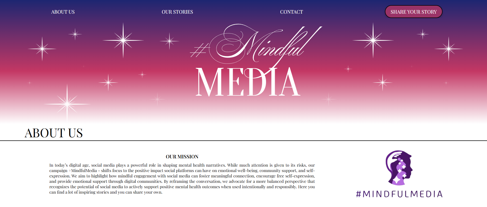

<h3 align="center">
  I’m a frontend developer specializing in creating modern and functional user interfaces. I have a strong foundation in HTML, CSS, and JavaScript, and I work with React on a daily basis. What sets me apart is my attention to detail and a mindset focused not just on aesthetics, but above all on quality and reliability.
</h3>

  
  
   
  
  
   
   
   
   
   

 

<h1 align="center">Reach me on</h1>

  &nbsp;&nbsp;&nbsp;&nbsp;
  

 

<h1 align="center">Currently Working On</h1>
  <h3 align="center">Mindful Media</h3> 
  

  
Mindful media is platform focused on promoting positive experiences with the social medias.

  
Built with React, TypeScript and SCSS.

  <a href="https://github.com/Xelo04/Mindful-Media" target="_blank" >
    
🔗 View Project on GitHub 

  </a>

   
  
<h1 align="center">My Github Stats</h1>

  
  &nbsp;&nbsp;&nbsp;
  

